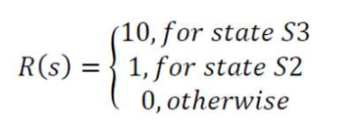

# RO11_TP5

### **Authors** : Lara Polachini and Henrique Gundlach Lacerda

---

The following questions are relative to the image below:

---

### **Question 1:** Enumarate all possible policies

A policy, usually identified as π, is the behavior of an agent in an environment. It is a mapping from states to actions. For example, the policy π:s→a defines: for each state s, the policy tells the agent which action a to take.

So, for this problem, the possible policies are exposed in the table below:

|  π   | Current state | Input | Next State |
|:----:|:--------------:|:-----:|:-----------:|
| π₁  | S₀             | a₁    | S₁          |
| π₂  | S₀             | a₂    | S₂          |
| π₃  | S₁             | a₀    | S₁          |
| π₄  | S₁             | a₀    | S₃          |
| π₅  | S₃             | a₀    | S₀          |
| π₆  | S₂             | a₀    | S₀          |
| π₇  | S₂             | a₀    | S₃          |

### **Question 2:** 

---

---

Using the transition functions:

And the reward functions:

we can write the equations for all the different states:

$$
V^*(S_0) = R(0) + \max_a \gamma [ T(S_0, a_1, S_1)V^*(S_1) + T(S_0, a_2, S_2)V^*(S_2) ]
$$

$$
V^*(S_0) = \max_a \gamma [ V^*(S_1) + V^*(S_2) ]
$$

---

$$
V^*(S_1) = R(1) + \max_a \gamma [ T(S_1, a_0, S_1)V^*(S_1) + T(S_1, a_0, S_3)V^*(S_3) ]
$$

$$
V^*(S_1) = \max_a \gamma [ (1 - x)V^*(S_1) + xV^*(S_3) ]
$$

---

$$
V^*(S_2) = R(2) + \max_a \gamma [ T(S_2, a_0, S_3)V^*(S_3) + T(S_2, a_0, S_0)V^*(S_0) ]
$$

$$
V^*(S_2) = 1 + \max_a \gamma [ yV^*(S_3) + (1 - y)V^*(S_0) ]
$$

---

$$
V^*(S_3) = R(3) + \max_a \gamma [ T(S_3, a_0, S_0)V^*(S_0) ]
$$

$$
V^*(S_3) = 10 + \max_a \gamma [ V^*(S_0) ]
$$

### **Question 3:** 

### **Question 4:** 
