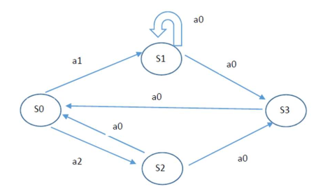
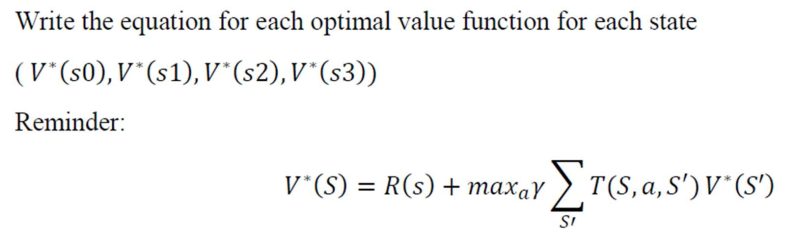
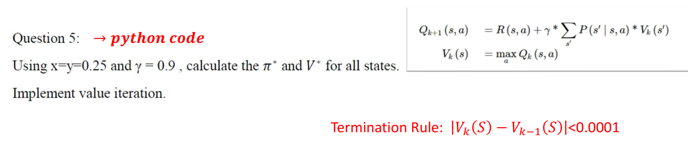

# RO11_TP5

### **Authors** : Lara Polachini and Henrique Gundlach Lacerda

---

The following questions are relative to the image below:



---

### **Question 1:** Enumarate all possible policies

A policy, usually identified as π, is the behavior of an agent in an environment. It is a mapping from states to actions. For example, the policy π:s→a defines: for each state s, the policy tells the agent which action a to take.

So, for this problem, the possible policies are exposed in the table below:

|  π   | Current state | Input | Next State |
|:----:|:--------------:|:-----:|:-----------:|
| π₁  | S₀             | a₁    | S₁          |
| π₂  | S₀             | a₂    | S₂          |
| π₃  | S₁             | a₀    | S₁          |
| π₄  | S₁             | a₀    | S₃          |
| π₅  | S₃             | a₀    | S₀          |
| π₆  | S₂             | a₀    | S₀          |
| π₇  | S₂             | a₀    | S₃          |

---

### **Question 2:** 

---



---

Using the transition functions:

$$
T(S, a_0, S') =
\begin{pmatrix}
0 & 0 & 0 & 0 \\
0 & 1 - x & 0 & x \\
1 - y & 0 & 0 & y \\
1 & 0 & 0 & 0
\end{pmatrix}
$$


$$
T(S, a_1, S') =
\begin{pmatrix}
0 & 1 & 0 & 0 \\
0 & 0 & 0 & 0 \\
0 & 0 & 0 & 0 \\
0 & 0 & 0 & 0
\end{pmatrix}
$$


$$
T(S, a_2, S') =
\begin{pmatrix}
0 & 0 & 1 & 0 \\
0 & 0 & 0 & 0 \\
0 & 0 & 0 & 0 \\
0 & 0 & 0 & 0
\end{pmatrix}
$$


And the reward functions:

$$
R(s) =
\begin{cases}
10, & \text{for state } S_3 \\
1,  & \text{for state } S_2 \\
0,  & \text{otherwise}
\end{cases}
$$


we can write the equations for all the different states:

```math
V^{*}(S_{0}) = R(0) + \max_{a}\, \gamma \, \left[ T(S_{0}, a_{1}, S_{1})\,V^{*}(S_{1}) + T(S_{0}, a_{2}, S_{2})\,V^{*}(S_{2}) \right]
```

```math
V^{*}(S_{0}) = \max_{a}\, \gamma \, \left[ V^{*}(S_{1}) + V^{*}(S_{2}) \right]
```

---

```math
V^{*}(S_{1}) = R(1) + \max_{a}\, \gamma \, \left[ T(S_{1}, a_{0}, S_{1})\,V^{*}(S_{1}) + T(S_{1}, a_{0}, S_{3})\,V^{*}(S_{3}) \right]
```

```math
V^{*}(S_{1}) = \max_{a}\, \gamma \, \left[ (1 - x)\,V^{*}(S_{1}) + x\,V^{*}(S_{3}) \right]
```

---

```math
V^{*}(S_{2}) = R(2) + \max_{a}\, \gamma \, \left[ T(S_{2}, a_{0}, S_{3})\,V^{*}(S_{3}) + T(S_{2}, a_{0}, S_{0})\,V^{*}(S_{0}) \right]
```

```math
V^{*}(S_{2}) = 1 + \max_{a}\, \gamma \, \left[ y\,V^{*}(S_{3}) + (1 - y)\,V^{*}(S_{0}) \right]
```

---

```math
V^{*}(S_{3}) = R(3) + \max_{a}\, \gamma \, \left[ T(S_{3}, a_{0}, S_{0})\,V^{*}(S_{0}) \right]
```

```math
V^{*}(S_{3}) = 10 + \max_{a}\, \gamma \, \left[ V^{*}(S_{0}) \right]
```

---

### **Question 3:** Is there a value for $ x $, such that for all $ \gamma \in [0,1) $ and $ y \in [0,1] $, $ \pi^{*}(S_{0}) = a_{2} $ ? Justify your answer.

Using the equation:

$$
\pi^*(s) = \arg\max_a \sum_{s'} T(s, a, s') V^*(s')
$$

we choose the action $a$ that gives the highest expected future value from state $s$

For each action at state $S_0$:

- **Action $a_2$:**
  $$
  Q^*(S_0, a_2) = V^*(S_2)
  $$

- **Action $a_1$:**
  $$
  Q^*(S_0, a_1) = V^*(S_1)
  $$

- **Action $a_0$:**
  $$
  Q^*(S_0, a_0) = (1 - x)V^*(S_1) + xV^*(S_3)
  $$

The optimal policy is:
$$
\pi^*(S_0) = \arg\max_a Q^*(S_0, a)
$$

---

Action $a_2$ is optimal if:
$$
V^*(S_2) \ge \max\{V^*(S_1),\ (1 - x)V^*(S_1) + xV^*(S_3)\}
$$

Since the immediate reward $R(S_2) = 1$ and $R(S_1) = 0$,
$$
V^*(S_2) > V^*(S_1)
$$
for all $\gamma \in (0,1)$. Therefore, $a_2$ already dominates $a_1$.

---

To ensure $a_2$ also beats $a_0$:

$$
(1 - x)V^*(S_1) + xV^*(S_3) \le V^*(S_2)
$$

we use $x = 0$. Then $E_{a_0} = V^*(S_1)$, and since $V^*(S_2) > V^*(S_1)$, $a_2$ is optimal.

---

So, hen $x = 0$, both $a_0$ and $a_1$ transition to $S_1$, while $a_2$ goes to $S_2$ with a higher reward.  
Thus, $a_2$ is the optimal action for all $\gamma \in [0,1)$ and $y \in [0,1]$.


### **Question 4:** 

Again, using the equation:

$$
\pi^*(s) = \arg\max_a \sum_{s'} T(s, a, s') V^*(s')
$$

we have

$$
\pi^*(S_0) = \arg\max_a \left[ T(S_0, a_1, S_1)V^*(S_1) + T(S_0, a_2, S_2)V^*(S_2) \right]
$$

$$
\pi^*(S_0) = \arg\max_a \left[ V^*(S_1) + V^*(S_2) \right]
$$

from what we take: for $\pi ^* (S_0) = a_1$ the $V^* (S_1)$ should be: $$V^*(S_1) \ge V^*(S_2)$$

$$
\max_a \gamma \left[ (1 - x)V^*(S_1) + xV^*(S_3) \right] \ge 1 + \max_a \gamma \left[ yV^*(S_3) + (1 - y)V^*(S_0) \right]
$$

### **Question 5:** 



Algorithm was implemented in the code that can be found in the same repository.